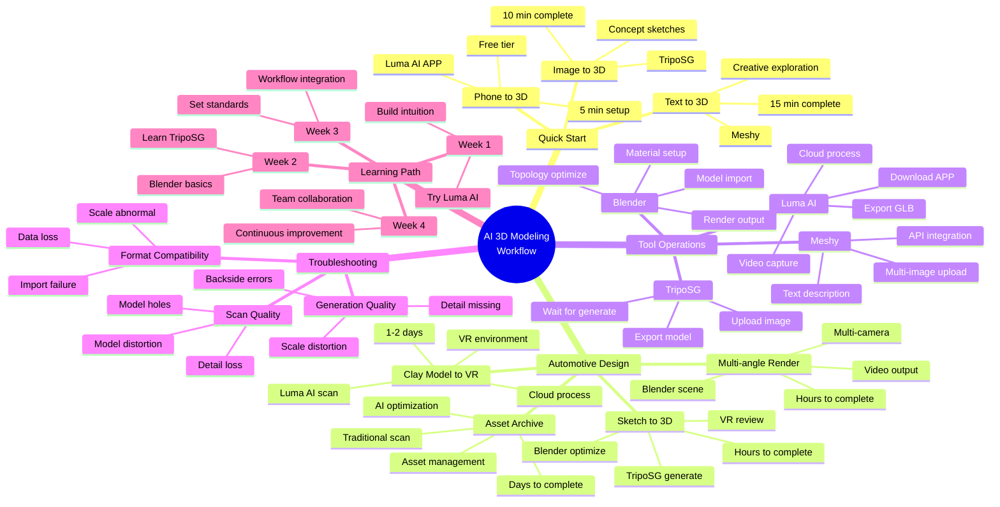

# AI 3D Modeling Workflow Mindmap



---

## Simplified Mindmap (Text Tree)

```
AI 3D Modeling Workflow
│
├─ 🚀 Quick Start
│   ├─ Phone to 3D ─────── Luma AI APP ──────── 5 min
│   ├─ Image to 3D ─────── TripoSG ──────────── 10 min
│   └─ Text to 3D ──────── Meshy ────────────── 15 min
│
├─ 🚗 Automotive Design
│   ├─ Sketch to 3D ────── TripoSG + Blender ─── Hours
│   │   ├─ Prepare sketch
│   │   ├─ AI generate
│   │   ├─ Blender optimize
│   │   └─ VR review
│   │
│   ├─ Clay Model to VR ── Luma AI + VR ──────── 1-2 days
│   │   ├─ Model prepare
│   │   ├─ Luma scan
│   │   ├─ Cloud process
│   │   ├─ Blender optimize
│   │   └─ VR review
│   │
│   ├─ Multi-angle Render ─ Meshy + Blender ──── Hours
│   │   ├─ Scene setup
│   │   ├─ Multi-camera
│   │   ├─ Static render
│   │   └─ Video output
│   │
│   └─ Asset Archive ────── Scan + AI ────────── Days
│       ├─ Vehicle selection
│       ├─ High-precision scan
│       ├─ Data processing
│       └─ Asset management
│
├─ 🔧 Tool Operations
│   ├─ Luma AI
│   │   ├─ Download APP
│   │   ├─ Video capture (30-90 sec)
│   │   ├─ Cloud process (20-40 min)
│   │   └─ Export GLB
│   │
│   ├─ TripoSG
│   │   ├─ Upload image (1024×1024+)
│   │   ├─ Wait for generate (2-5 min)
│   │   └─ Export GLB
│   │
│   ├─ Meshy
│   │   ├─ Text description / Multi-image
│   │   ├─ Wait for generate (5-15 min)
│   │   └─ Export GLB/OBJ/FBX
│   │
│   └─ Blender
│       ├─ Import model
│       ├─ Topology optimize (Remesh)
│       ├─ Material setup
│       └─ Render output
│
├─ ⚠️ Troubleshooting
│   ├─ Scan Quality
│   │   ├─ Model holes → Incomplete coverage → Rescan
│   │   ├─ Detail loss → Too fast movement → Slow down
│   │   └─ Model distortion → Object moved → Keep still
│   │
│   ├─ Generation Quality
│   │   ├─ Backside error → AI limitation → Manual fix
│   │   ├─ Scale distortion → Image perspective → Standard view
│   │   └─ Detail missing → Low resolution → Increase res
│   │
│   └─ Format Compatibility
│       ├─ Import fail → Format issue → Use GLB
│       ├─ Scale abnormal → Unit issue → Apply Scale
│       └─ Normal flipped → Calculation error → Recalculate
│
└─ 📚 Learning Path
    ├─ Week 1 ─ Try Luma AI ──────────── 2-3 hours
    ├─ Week 2 ─ Learn TripoSG+Blender ── 5-10 hours
    ├─ Week 3 ─ Workflow integration ──── 10-20 hours
    └─ Week 4 ─ Team collaboration ────── Continuous
```

---

## Core Workflow Diagrams

### Workflow 1: Concept Sketch to VR Review

```
┌─────────────┐    ┌─────────────┐    ┌─────────────┐    ┌─────────────┐
│   Concept   │───▶│   TripoSG   │───▶│   Blender   │───▶│  VR Review  │
│   Sketch    │    │  AI Generate│    │   Optimize  │    │             │
└─────────────┘    └─────────────┘    └─────────────┘    └─────────────┘
      │                  │                  │                  │
      ▼                  ▼                  ▼                  ▼
  ┌────────┐        ┌────────┐        ┌────────┐        ┌────────┐
  │1024×1024│        │ 2-5 min│        │ Hours  │        │ 1:1    │
  │Plain bg │        │Export  │        │Topology│        │Team    │
  └────────┘        └────────┘        └────────┘        └────────┘
```

### Workflow 2: Clay Model to VR Review

```
┌─────────────┐    ┌─────────────┐    ┌─────────────┐    ┌─────────────┐
│ Clay Model  │───▶│   Luma AI   │───▶│   Blender   │───▶│  VR Review  │
│             │    │    Scan     │    │   Optimize  │    │             │
└─────────────┘    └─────────────┘    └─────────────┘    └─────────────┘
      │                  │                  │                  │
      ▼                  ▼                  ▼                  ▼
  ┌────────┐        ┌────────┐        ┌────────┐        ┌────────┐
  │Even lit│        │ 2-3 min│        │ Fix    │        │Immersive│
  │Complete│        │ 20-40m │        │Export  │        │Remote  │
  └────────┘        └────────┘        └────────┘        └────────┘
```

### Workflow 3: Multi-angle Render Video

```
┌─────────────┐    ┌─────────────┐    ┌─────────────┐    ┌─────────────┐
│   3D Model  │───▶│   Blender   │───▶│   Render    │───▶│   Output    │
│             │    │Scene Setup  │    │             │    │             │
└─────────────┘    └─────────────┘    └─────────────┘    └─────────────┘
      │                  │                  │                  │
      ▼                  ▼                  ▼                  ▼
  ┌────────┐        ┌────────┐        ┌────────┐        ┌────────┐
  │AI/Exist│        │HDRI+Cam│        │Multi   │        │PNG/MP4 │
  │        │        │        │        │Angles  │        │        │
  └────────┘        └────────┘        └────────┘        └────────┘
```

---

## Tool Selection Decision Tree

```
                    What do you need?
                          │
          ┌───────────────┼───────────────┐
          ▼               ▼               ▼
      Quick Try       Precise Model   Batch Process
          │               │               │
          ▼               ▼               ▼
     ┌─────────┐    ┌─────────┐    ┌─────────┐
     │Luma AI  │    │Input Type│    │ Meshy   │
     │ APP     │    └─────────┘    │ API     │
     └─────────┘         │          └─────────┘
                         │
           ┌─────────────┼─────────────┐
           ▼             ▼             ▼
        Single       Multiple        Real
        Image        Images         Object
           │             │             │
           ▼             ▼             ▼
      ┌─────────┐   ┌─────────┐   ┌─────────┐
      │TripoSG  │   │ Meshy   │   │ Luma AI │
      │ 10 min  │   │Multi-view│  │ 20-40m  │
      └─────────┘   └─────────┘   └─────────┘
```

---

## Time Efficiency Comparison

```
┌────────────────────┬──────────────────┬──────────────────┬──────────┐
│       Task         │  Traditional     │     AI Method    │ Speedup  │
├────────────────────┼──────────────────┼──────────────────┼──────────┤
│ Sketch to 3D       │ 2-4 weeks        │ 2-4 hours        │ 50x+     │
├────────────────────┼──────────────────┼──────────────────┼──────────┤
│ Clay to VR Review  │ 2-4 weeks        │ 1-2 days         │ 10x+     │
├────────────────────┼──────────────────┼──────────────────┼──────────┤
│ Render Showcase    │ Weeks            │ Hours            │ 20x+     │
├────────────────────┼──────────────────┼──────────────────┼──────────┤
│ Batch Modeling     │ 4-8 hrs/model    │ 15-30 min/model  │ 10x+     │
└────────────────────┴──────────────────┴──────────────────┴──────────┘
```

---

## Key Reminders

```
┌─────────────────────────────────────────────────────────┐
│  ⚠️  AI 3D ≠ Replace traditional CAD tools              │
│      AI 3D = Quick exploration layer before CAD         │
├─────────────────────────────────────────────────────────┤
│  ⚠️  Generated models need manual review & optimization │
├─────────────────────────────────────────────────────────┤
│  ⚠️  Backside completion has uncertainty, verify needed │
├─────────────────────────────────────────────────────────┤
│  ⚠️  Pay attention to data security & confidentiality   │
├─────────────────────────────────────────────────────────┤
│  ⚠️  Complex geometry reconstruction quality varies     │
└─────────────────────────────────────────────────────────┘
```

---

## Glossary

| Term | Description |
|------|-------------|
| **GLB** | GL Transmission Format Binary - universal 3D format |
| **HDRI** | High Dynamic Range Image - environment lighting |
| **Topology** | Edge flow and polygon structure of 3D model |
| **VR** | Virtual Reality - immersive 3D experience |
| **Remesh** | Rebuild mesh topology for better quality |
| **UV** | 2D coordinate mapping for 3D model textures |
| **Cycles** | Blender's physically-based render engine |
| **PBR** | Physically Based Rendering - realistic materials |

---

## Quick Reference Card

### Luma AI Scan Checklist
- [ ] Even lighting, no strong shadows
- [ ] Simple background
- [ ] Object completely still
- [ ] Cover all angles (3+ circles)
- [ ] Move slowly and steadily
- [ ] Video length 30-90 seconds

### TripoSG Upload Checklist
- [ ] Image resolution 1024×1024 or higher
- [ ] Subject fills 60%+ of frame
- [ ] Plain or simple background
- [ ] Standard angle (front/side)
- [ ] No heavy shadows

### Blender Optimization Steps
1. Import model (GLB format)
2. Check topology quality
3. Mesh → Clean up → Fill Holes
4. Mesh → Normals → Recalculate Outside
5. Add Remesh modifier if needed
6. Set up materials and lighting
7. Render with Cycles

### VR Review Preparation
1. Export as FBX or glTF format
2. Import to Unity/Unreal
3. Add XR plugin
4. Set up VR camera
5. Configure environment lighting
6. Test 1:1 scale viewing
7. Enable team collaboration features
