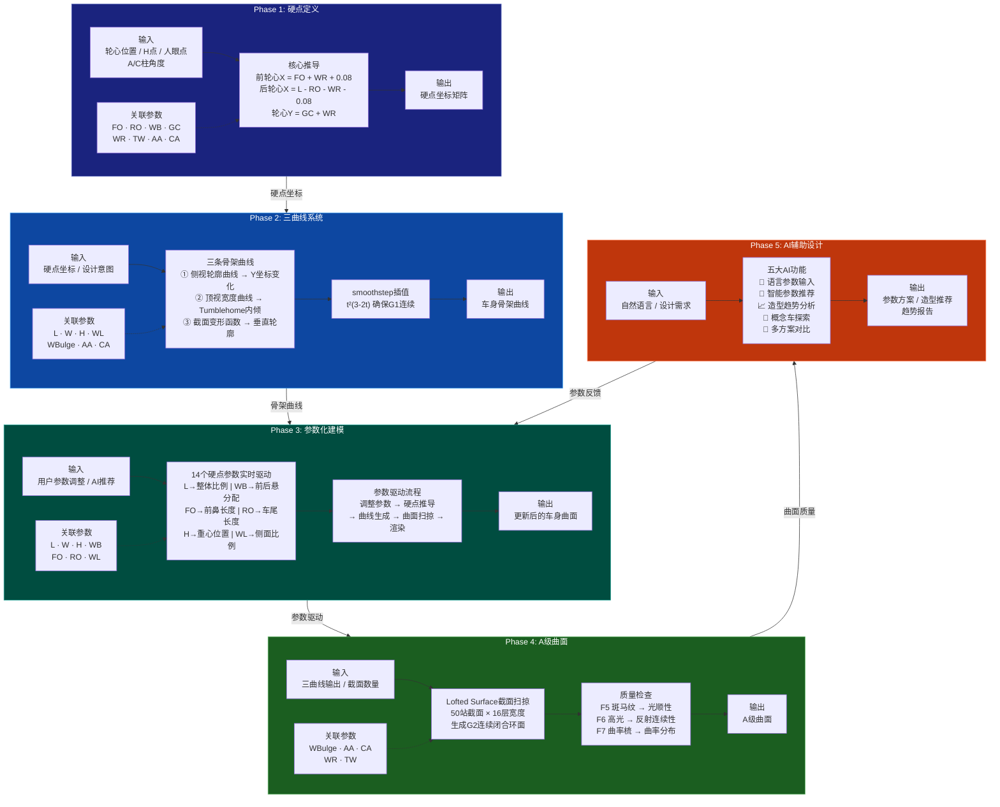

# EVOLUTION AI 五阶段开发流程图

## Mermaid 流程图（可直接在支持Mermaid的编辑器中渲染）



---

## 文字版流程图（兼容所有Markdown渲染器）

```
┌─────────────────────────────────────────────────────────────────────────────────────┐
│                          EVOLUTION AI 五阶段开发流程                                  │
└─────────────────────────────────────────────────────────────────────────────────────┘

  ┌──────────────────────┐       ┌──────────────────────┐       ┌──────────────────────┐
  │  Phase 1: 硬点定义    │       │  Phase 2: 三曲线系统  │       │  Phase 3: 参数化建模  │
  │                      │       │                      │       │                      │
  │  输入:               │       │  输入:               │       │  输入:               │
  │  · 轮心位置          │       │  · 硬点坐标          │       │  · 用户参数调整       │
  │  · H点 / 人眼点      │──────▶│  · 设计意图          │──────▶│  · AI推荐参数        │
  │  · A/C柱角度         │       │                      │       │                      │
  │                      │       │  核心:               │       │  核心:               │
  │  核心:               │       │  ① 侧视轮廓曲线      │       │  14个硬点参数实时驱动  │
  │  前轮心X=FO+WR+0.08  │       │  ② 顶视宽度曲线      │       │  L→比例 WB→悬分配     │
  │  后轮心X=L-RO-WR-0.08│       │  ③ 截面变形函数      │       │  FO→前鼻 RO→车尾      │
  │  轮心Y=GC+WR         │       │  smoothstep G1连续   │       │  H→重心 WL→侧面       │
  │                      │       │                      │       │                      │
  │  输出:               │       │  输出:               │       │  输出:               │
  │  硬点坐标矩阵        │       │  车身骨架曲线        │       │  更新车身曲面         │
  │                      │       │                      │       │                      │
  │  参数:               │       │  参数:               │       │  参数:               │
  │  FO·RO·WB·GC         │       │  L·W·H·WL           │       │  L·W·H·WB            │
  │  WR·TW·AA·CA         │       │  WBulge·AA·CA        │       │  FO·RO·WL            │
  └──────────────────────┘       └──────────────────────┘       └──────────────────────┘
              │                              │                              │
              │                              │                              │
              ▼                              ▼                              ▼
  ┌──────────────────────┐       ┌──────────────────────┐       ┌──────────────────────┐
  │  Phase 4: A级曲面     │       │  Phase 5: AI辅助设计  │       │  ◀── 参数反馈循环 ──▶ │
  │                      │       │                      │       │                      │
  │  输入:               │       │  输入:               │       │  Phase 5 的AI推荐     │
  │  · 三曲线输出        │──────▶│  · 自然语言描述      │──────▶│  参数反馈到 Phase 3   │
  │  · 截面数量          │       │  · 设计需求          │       │  形成闭环优化         │
  │                      │       │                      │       │                      │
  │  核心:               │       │  核心:               │       └──────────────────────┘
  │  Lofted Surface扫掠  │       │  💬 语言参数输入      │
  │  50站×16层宽度       │       │  🤖 智能参数推荐      │
  │  G2曲率连续          │       │  📈 造型趋势分析      │
  │                      │       │  🚀 概念车探索        │
  │  检查:               │       │  🔄 多方案对比        │
  │  F5 斑马纹→光顺性    │       │                      │
  │  F6 高光→反射连续    │       │  输出:               │
  │  F7 曲率梳→曲率分布  │       │  参数方案 / 造型推荐  │
  │                      │       │  趋势报告            │
  │  输出:               │       │                      │
  │  A级曲面             │       │                      │
  │                      │       │                      │
  │  参数:               │       │                      │
  │  WBulge·AA·CA        │       │                      │
  │  WR·TW               │       │                      │
  └──────────────────────┘       └──────────────────────┘
```

---

## PPT精简版（单页横向布局）

```
┌─────────────────────────────────────────────────────────────────────────────────────────────┐
│                              EVOLUTION AI · 硬点驱动五阶段开发流程                            │
├───────────────┬───────────────┬───────────────┬───────────────┬─────────────────────────────┤
│               │               │               │               │                             │
│  Phase 1      │  Phase 2      │  Phase 3      │  Phase 4      │  Phase 5                    │
│  硬点定义      │  三曲线系统    │  参数化建模    │  A级曲面       │  AI辅助设计                 │
│               │               │               │               │                             │
│  轮心/H点/     │  侧视轮廓     │  14参数实时    │  50站截面扫掠  │  💬 语言输入                │
│  人眼点/       │  顶视宽度     │  驱动车身      │  G2曲率连续    │  🤖 智能推荐                │
│  A/C柱角度     │  截面变形     │  形态变化      │  斑马纹/高光   │  📈 趋势分析                │
│               │  smoothstep   │               │  曲率梳检查    │  🚀 概念探索                │
│  ────────────▶│  ────────────▶│  ────────────▶│  ────────────▶│  🔄 方案对比                │
│  硬点坐标矩阵  │  车身骨架曲线  │  更新车身曲面  │  A级曲面       │  参数方案/推荐              │
│               │               │       ▲       │               │                             │
│  FO·RO·WB·GC  │  L·W·H·WL    │  L·W·H·WB    │  WBulge·AA    │       │                     │
│  WR·TW·AA·CA  │  WBulge·AA·CA│  FO·RO·WL    │  WR·TW        │       └─── 参数反馈循环 ──────┘│
│               │               │       │       │               │                             │
└───────────────┴───────────────┴───────┴───────┴───────────────┴─────────────────────────────┘
```

---

## 纵向时间线版（适合纵向排版）

```
                    EVOLUTION AI 五阶段开发流程
                    ━━━━━━━━━━━━━━━━━━━━━━━━

    ┌─────────────────────────────────────────────┐
    │  Phase 1: 硬点定义                           │
    │  ─────────────────                          │
    │  📌 目标: 建立核心硬点，定义物理约束边界       │
    │  📥 输入: 轮心/H点/人眼点/A-C柱角度          │
    │  📤 输出: 硬点坐标矩阵                       │
    │  🔧 参数: FO·RO·WB·GC·WR·TW·AA·CA          │
    │  💡 核心: 前轮心X=FO+WR+0.08                │
    │         后轮心X=L-RO-WR-0.08                │
    └──────────────────────┬──────────────────────┘
                           │
                           ▼
    ┌─────────────────────────────────────────────┐
    │  Phase 2: 三曲线系统                         │
    │  ─────────────────                          │
    │  📌 目标: 构建车身骨架曲线，定义车身形态       │
    │  📥 输入: 硬点坐标 + 设计意图                 │
    │  📤 输出: 侧视轮廓 + 顶视宽度 + 截面变形      │
    │  🔧 参数: L·W·H·WL·WBulge·AA·CA            │
    │  💡 核心: smoothstep(t)=t²(3-2t) G1连续     │
    │         Tumblehome内倾减少风阻               │
    └──────────────────────┬──────────────────────┘
                           │
                           ▼
    ┌─────────────────────────────────────────────┐
    │  Phase 3: 参数化建模                         │
    │  ─────────────────                          │
    │  📌 目标: 14个可调参数实时驱动车身形态变化     │
    │  📥 输入: 用户参数调整 + AI推荐参数           │
    │  📤 输出: 更新后的车身曲面                    │
    │  🔧 参数: L·W·H·WB·FO·RO·WL                │
    │  💡 核心: L→比例 WB→悬分配 FO→前鼻           │
    │         RO→车尾 H→重心 WL→侧面               │
    └──────────────────────┬──────────────────────┘
                           │
                           ▼
    ┌─────────────────────────────────────────────┐
    │  Phase 4: A级曲面                            │
    │  ─────────────────                          │
    │  📌 目标: 生成G2连续A级曲面                   │
    │  📥 输入: 三曲线输出 + 截面数量               │
    │  📤 输出: A级曲面                            │
    │  🔧 参数: WBulge·AA·CA·WR·TW                │
    │  💡 核心: 50站×16层 Lofted Surface扫掠       │
    │         F5斑马纹 F6高光 F7曲率梳             │
    └──────────────────────┬──────────────────────┘
                           │
                           ▼
    ┌─────────────────────────────────────────────┐
    │  Phase 5: AI辅助设计                         │
    │  ─────────────────                          │
    │  📌 目标: AI技术辅助创意设计和决策             │
    │  📥 输入: 自然语言描述 + 设计需求             │
    │  📤 输出: 参数方案 + 造型推荐 + 趋势报告      │
    │  💡 核心: 💬语言输入 🤖智能推荐 📈趋势分析    │
    │         🚀概念探索 🔄方案对比                 │
    └──────────────────────┬──────────────────────┘
                           │
                           │  参数反馈循环
                           └──────────────────▶ Phase 3
```

---

## 数据流图（强调输入输出关系）

```
                        EVOLUTION AI 数据流图

  ┌──────────┐    硬点参数     ┌──────────┐   骨架曲线    ┌──────────┐
  │          │ ──────────────▶ │          │ ───────────▶ │          │
  │ Phase 1  │   FO·RO·WB     │ Phase 2  │  侧视+顶视   │ Phase 3  │
  │ 硬点定义  │   GC·WR·TW     │ 三曲线    │  +截面变形   │ 参数化    │
  │          │   AA·CA        │          │              │          │
  └──────────┘                └──────────┘              └─────┬────┘
                                                           │
                                              参数驱动 ────┤
                                                           │
                                                           ▼
  ┌──────────┐   曲面质量    ┌──────────┐   AI推荐参数  ┌──────────┐
  │          │ ◀──────────── │          │ ◀─────────── │          │
  │ Phase 4  │   G2连续      │ Phase 5  │  语言解析     │          │
  │ A级曲面  │   斑马纹      │ AI辅助    │  趋势分析     │          │
  │          │   高光/曲率梳  │          │  方案对比     │          │
  └──────────┘               └──────────┘              └──────────┘
       │                          │                          │
       ▼                          ▼                          ▼
   A级曲面                   参数反馈循环              设计决策
  (最终输出)              ──────────────────▶ Phase 3
```
