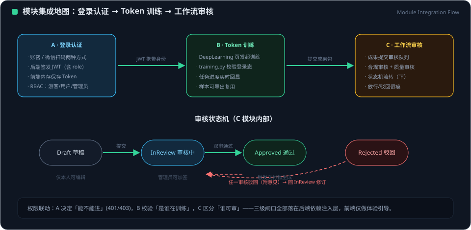

# 模块集成流程：登录认证 → Token 训练 → 工作流审核

> 版本 v1.0 · 2026-09-27 · 状态：已实现并通过端到端验证
> 关联模块：认证（auth）· 训练（training）· 工作流（workflow）· 项目（projects）· 前端 DeepLearning

## 1. 概述与设计目标

本报告梳理 EVOLUTION AI 平台中认证、训练、工作流三大模块的功能关联性，并落地一条端到端业务主链：

1. **身份验证**：用户登录账户，验证身份并获取有效 JWT Token；
2. **凭据训练**：以该 Token 作为身份凭证，启动并执行项目训练任务；
3. **产出送审**：将训练产出自动接入预设的工作流审核系统，确保产出经过**合规性审核**与**质量审核**两道人工把关。

设计原则：凭据最小暴露（Token 仅存于前端内存/localStorage 与请求头，绝不出现在日志）；归属强校验（训练产出只能由本人送审）；审核不可绕过（自动执行通道对审核型工作流显式拒绝）。

## 2. 模块功能关联地图

<figure class="doc-figure">
  
  <figcaption>图 2-1 ｜ 登录认证 → Token 训练 → 工作流审核的模块集成地图与审核状态机</figcaption>
</figure>

```
┌─────────────┐  ①邮箱+密码   ┌──────────────┐  ②签发JWT(7天)  ┌──────────────────┐
│  Login.vue  │─────────────▶│ auth.py      │───────────────▶ │ auth store        │
└─────────────┘              │ /auth/login  │                 │ localStorage 持久化│
                             └──────────────┘                 └────────┬─────────┘
                                                                       │ ③Bearer Token
                                            axios 请求拦截器自动注入 ◀──┘（401 统一广播 auth-required）
                                                       │
┌────────────────────┐  ④启动训练(需Token)  ┌──────────────────┐
│ DeepLearning.vue   │────────────────────▶│ training.py       │──▶ TrainingTask 表
│ (身份闸口+轮询监控) │◀──任务状态轮询──────│ /ai/train 后台线程 │    (user_id 归属 + metrics_json)
└────────────────────┘                     └──────────────────┘         │ ⑤训练完成自动触发
                                                                       ▼
┌──────────────┐  ⑥挂载   ┌───────────────────────────────┐
│ Project 表   │◀────────│ workflow.py                    │
└──────────────┘          │ /workflows/training-review     │
       ▲                  │  预置：合规性审核→质量审核(人工) │
       └──⑦查看项目──────── └───────────────────────────────┘
```

| 模块 | 核心职责 | 与上下游的关联点 |
| --- | --- | --- |
| 认证 | 身份验证、JWT 签发/校验 | 所有受保护接口的 `Depends(get_current_user)` 依赖注入 |
| 训练 | PyTorch 后台任务、产出指标/checkpoint | `TrainingTask.user_id` 归属校验；产出摘要作为审核证据 |
| 工作流 | 流程编排与人工审核 | `Workflow.project_id → Project`；步骤 `input_params` 承载训练证据 JSON |
| 项目 | 资源容器 | 训练审核流自动挂载到用户项目下，项目详情页可追溯 |

## 3. 端到端流程详解

### 3.1 登录验证 → Token

前端 `Login.vue` 收集邮箱与密码，调用 `POST /api/v1/auth/login`；后端校验通过后签发 7 天有效期的 JWT。前端将 `access_token` 持久化到 localStorage（键 `evoai_token`），并由 axios 请求拦截器为后续所有业务请求自动附加 `Authorization: Bearer <token>`。收到 401 时统一清除 Token 并广播 `evoai:auth-required` 事件，驱动全局登录态恢复。

### 3.2 Token → 启动训练

DeepLearning 页面在"开始训练"动作前置**身份验证闸口**：未登录时弹出友好引导弹窗，确认后跳转 `/login?redirect=/deep-learning`，登录成功后回跳原页。后端 `POST /ai/train` 强制 `Depends(get_current_user)` JWT 校验，训练任务落库时写入 `user_id`，从数据层保证任务归属。前端按秒轮询 `GET /ai/tasks/{id}`，直至任务进入 completed / failed / cancelled 终态。

### 3.3 训练产出 → 预设审核流

任务轮询进入 `completed` 终态后，前端自动调用 `POST /workflows/training-review`（携带 Bearer Token）。后端依次校验：项目存在 → 任务归属本人（`TrainingTask.user_id == Token.sub`）→ 任务已完成。校验通过后创建 `training_review` 类型工作流并预置两道**人工**审核步骤：

1. **合规性审核（compliance）**：数据来源、合成样本声明、训练配置合规性；
2. **质量审核（quality_review）**：最佳验证准确率等产出指标是否达标。

两步骤的 `input_params` 携带训练证据摘要（task_id、任务名、数据集、最佳验证准确率、提交人邮箱），审核全程可追溯。审核状态通过 `POST /workflows/{id}/steps/{sid}/review` 逐步推进；`execute` 自动执行通道对 `training_review` 类型显式返回 400，杜绝绕过人工审核。

## 4. 数据交互方式与接口调用规范

| 接口 | 方法 | 鉴权 | 请求体 | 响应 / 状态码 |
| --- | --- | --- | --- | --- |
| `/api/v1/auth/login` | POST | 公开 | `{email, password}` | `access_token`（JWT，7 天） |
| `/api/v1/ai/train` | POST | **必需** | `{dataset, epochs, batch_size, learning_rate, samples, seed, car_type}` | 任务对象（含轮询 id） |
| `/api/v1/ai/tasks/{id}` | GET | 必需 | — | 任务状态/进度/指标（轮询） |
| `/api/v1/workflows/training-review` | POST | **必需** | `{project_id, task_id}` | 201 工作流对象；404 项目/任务不存在；400 任务未完成 |
| `/api/v1/workflows/{id}/steps/{sid}/review` | POST | **必需** | `{approved: bool, comment?: str(≤500)}` | 200 + `workflow_status`；400 步骤不可审/已终态 |
| `/api/v1/workflows/{id}/steps` | GET | 可选 | — | 步骤明细（状态/进度/审核输入输出） |

约定：鉴权失败统一返回 `401 {"detail":"缺少认证信息，请先登录"}` 或 `401 {"detail":"Token 无效或已过期"}`；业务校验失败返回 400/404 并在 `detail` 中给出可读原因；审核结论中的 `comment` 上限 500 字符。

## 5. 权限验证机制

- **签发**：JWT 载荷携带 `sub`（user_id）、`email`、`exp`、`iat`，签名算法 HS256；
- **传输**：仅经 `Authorization: Bearer` 请求头传递，不落入 URL 查询参数，不写入日志；
- **校验**：受保护路由通过 `Depends(get_current_user)` 解析并验证签名与有效期，失败即 401；
- **归属强校验（授权层）**：送审接口执行双重校验——任务 `user_id` 必须等于 Token 主体（防越权送审他人产出），且任务必须处于 completed 终态；
- **审计**：审核结论落库时记录 `reviewer` 邮箱与时间戳，形成不可抵赖的审核证据链。

## 6. 审核状态机

```
                    创建（训练完成自动触发）
                            │
                            ▼
                       ┌─────────┐   任一步骤驳回    ┌─────────┐
                       │ pending │─────────────────▶│ failed  │
                       └────┬────┘                  └─────────┘
                       首步通过
                            ▼
                       ┌─────────┐   任一步骤驳回    ┌─────────┐
                       │ running │─────────────────▶│ failed  │
                       │(审核中) │                   └─────────┘
                       └────┬────┘
                    全部步骤通过
                            ▼
                       ┌──────────┐
                       │ completed │
                       └──────────┘
```

步骤级状态：`pending →（审核通过）completed` 或 `pending →（驳回）rejected`；rejected 为终态，需重新发起训练或另行处理。工作流级状态由步骤聚合推导，无手工置入路径。

## 7. 验证记录

端到端链路实测（2026-09-27，全部通过）：

| # | 场景 | 期望 | 实测 |
| --- | --- | --- | --- |
| 1 | 无 Token 调用审核端点 | 401 | `{"detail":"缺少认证信息，请先登录"}` |
| 2 | 登录获取 Token + 创建项目 | 200 / 201 | 通过 |
| 3 | Token 创建训练审核流 | 201 + 预置 2 步骤 + 证据摘要 | 通过 |
| 4 | execute 自动执行审核流 | 400 拒绝 | 通过 |
| 5 | 合规性审核通过 | workflow: pending→running | 通过 |
| 6 | 质量审核通过 | workflow: running→completed | 通过 |
| 7 | 驳回分支 | workflow: →failed | 通过 |

回归基线：vitest 111 用例全绿、`vite build` 通过。验证产生的临时用户/项目/工作流数据已清理。

## 8. 关联文档

- [架构设计](ARCHITECTURE_DESIGN.md)：五层架构、路由模块与 ORM 表全景
- [API 参考](api_reference.md)：全部 118 端点逐端明细
- [开发方法论](methodology.md)：五维度方法论与 SOP
- [验证报告](VALIDATION_REPORT_20260927.md)：平台质量证据链最新基线
