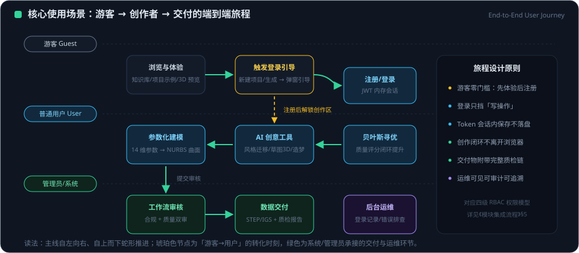

# 产品功能定义文档

> 版本：平台 v1.2（2026-09-27 基于代码现状更新）
> 本文描述平台**已实现**的功能；页面功能均与源码调用的接口 / Store 逐一对应。

---

## 1. 产品定位

EVOLUTION AI 是面向汽车造型开发的 AI 平台，目标是实现
「**从一句话到 3D 整车**」：概念参数输入 → 参数化建模 → AI 优化 →
质量分析 → 工程交付的全链路辅助。

平台同时承载：

- **设计端**：参数化车身实时生成与 3D 预览、变体管理、品牌车型知识库；
- **智能端**：深度学习训练、生成式设计、贝叶斯优化、NURBS 专家对话、LLM 统一代理；
- **工程端**：CAD 导入改参、A 级曲面质量检查、多格式导出与数据交接；
- **账户端**：注册登录（密码 / 微信）、API Key 管理。

---

## 2. 用户角色

| 角色 | 核心诉求 | 主要页面 |
|---|---|---|
| 汽车造型设计师 | 快速生成与比较造型方案 | Designer、DeepLearning、Demo |
| 项目负责人 | 管理项目、模型与工作流 | Dashboard、Projects、ProjectDetail |
| 曲面 / 质量工程师 | A 级曲面质量检查与工程交付 | Quality、Deliver |
| ML 工程师 | 训练任务、样本生成与导出 | DeepLearning（含贝叶斯联动） |
| 普通注册用户 | 账户与个人 API Key | Login、Account |
| 管理员 | 可见全部训练任务；用户管理字段已具备 | 全站（is_admin） |

---

## 3. 核心使用场景（端到端）

<figure class="doc-figure">
  
  <figcaption>图 3-1 ｜ 核心场景端到端旅程：游客体验 → 注册解锁 → 创作优化 → 审核交付</figcaption>
</figure>

1. **参数化概念设计**：在 Designer 选择车型/风格与参数 → 生成 3D 整车 →
   云端样本批次 / 质量评估 / 生成式设计 / 优化 → 保存变体对比。
2. **CAD 导入改参导出**：在 Deliver 上传 CAD/模型文件 → 解析参数 →
   修改参数并 3D 预览 → 选择格式导出下载。
3. **质量驱动迭代**：Quality 发起质量检查 → 查看报告与历史 →
   依据分数回到设计端调整。
4. **ML 训练闭环**：DeepLearning 创建后台 PyTorch 训练任务 → 轮询进度/指标 →
   取消或完成；样本可由贝叶斯优化容器产出。
5. **贝叶斯寻优**：创建优化会话 → 建议参数 → 评分回填 → 收敛 → 导出训练样本。
6. **账户与登录**：注册 / 密码登录 / 微信扫码或公众号授权登录；
   Account 中配置各 LLM 提供商 API Key。

---

## 4. 页面功能定义

### 4.1 Dashboard（`/`）

- 平台总览首页：能力与模块导航。
- 登录态由全局路由守卫与 auth Store 提供。

### 4.2 Designer（`/designer`）

AI 参数化设计器，平台核心工作台：

- 车型 / 风格 / 品牌参数选择，参数面板输入；
- `carAPI.generate` 生成整车，3D 实时渲染；
- 云端能力（经 `aiAPI`）：
  - `getDatasetStats` 数据集统计；
  - `trainBatch` 云端合成样本批次；
  - `evaluateQuality` 造型参数质量评估；
  - `generateDesign` 生成式设计；
  - `optimize` 参数优化。

### 4.3 Projects（`/projects`）

- 项目列表（支持按状态过滤），数据经 project Store → `projectAPI.list`；
- 新建项目（`projectAPI.create`）；
- 删除项目（`projectAPI.delete`）；
- 后端不可用时以 mock 项目兜底。

### 4.4 ProjectDetail（`/projects/:id`）

- 项目详情（`projectAPI.get`）、编辑更新（`projectAPI.update`）；
- 模型构建与状态查看（buildAPI）、模型文件管理（modelAPI）；
- 变体（variantAPI）、工作流（workflowAPI）在详情中组织。

### 4.5 DeepLearning（`/deep-learning`）

深度学习设计器：

- 创建后台 PyTorch 训练任务 `aiAPI.train`，任务参数（epochs/batch_size/lr 等）；
- 任务轮询 `getTask`（状态、进度、指标、日志）、取消 `cancelTask`；
- 任务列表 `listTasks`；
- 训练能力与并发情况 `getTrainingCapabilities`；
- 含风格迁移等能力介绍分区（i18n 文案）。

### 4.6 Quality（`/quality`）

- 发起质量检查 `qualityAPI.check`；
- 报告列表（可按项目 / 模型过滤）`qualityAPI.list`；
- 报告详情 `qualityAPI.get`：等级、G0/G1/G2、报告数据；
- 历史字符串报告自动规整为结构化展示。

### 4.7 Deliver（`/deliver`）

工程交付中心，对接导入改参导出全链路（`importExportAPI`）：

- 会话列表；通过 JSON 参数或直接上传文件导入（`importModel` / `importFile`）；
- 参数查询 `getParams`、参数修改 `modifyParams`；
- 参数快照 `getSnapshot`；3D 预览（preview）；
- 多格式导出 `exportModel`、文件下载 `downloadFile`；
- 会话删除。

### 4.8 Demo（`/demo`）

功能演示页：拉取车身参数（`carAPI.getParameters`）、生成演示整车
（`carAPI.generate`）、导出（`carAPI.export`）。

### 4.9 Login（`/login`，公开页）

- 登录方式探测 `authAPI.methods`，按后端配置显示可用入口；
- 密码登录 / 注册（auth Store → authAPI）；
- 微信开放平台扫码：`wechatQr` 获取二维码；
- 微信公众号网页授权：`mpAuthorize` → `mpPoll` 轮询票据结果；
- 登录成功写入 token 并按回跳地址返回。

### 4.10 Account（`/account`）

- 当前账户信息；
- LLM 提供商 API Key 管理（`apiKeyAPI`）：列表查看、设置、删除
  （后端 Fernet 加密存储）。

### 4.11 Help（`/help`）

- **3D 知识图谱**：12 份知识库文档以三维节点呈现，按 4 层（哲学与方法论 / 战略与学术 / 架构与 API / 质量与验证）聚类，节点间以逻辑关系连线；拖拽旋转、滚轮缩放、点击节点加载文档原文（Markdown）并提供 PDF 下载；
- **模块使用手册**：11 个页面模块的功能说明、入口路径与实用提示；
- **文档体系**：四层知识体系总览与三大工程原则（信号优先 / 薄壳编排 / 全链路可审计）。

---

## 5. 平台能力矩阵

| 能力域 | 已实现能力 |
|---|---|
| 车身生成 | 整车 / 单部件参数化生成、参数查询、重生成、导出 |
| 模型管理 | 上传、列表、详情、删除、构建 / 重建 / 批量构建、缓存管理 |
| 变体与版本 | 创建、列表、详情、历史、对比、回滚 |
| 工作流 | 创建、列表、详情、执行、步骤、更新、删除 |
| 质量工程 | 质量检查、报告列表 / 详情、拓扑优化、数据交接 |
| 导入导出 | 文件 / 参数导入、参数树与分组、改参、预览、快照、多格式导出、下载 |
| AI 训练 | PyTorch 后台训练、任务管理、合成批次、能力查询 |
| AI 分析 | 质量评估、生成式设计、参数优化、数据集统计 |
| 贝叶斯优化 | 会话、建议（EI/UCB）、观测、最优、样本导出 |
| LLM | 多提供商统一代理（对话 / 嵌入 / 文生图）、NURBS 专家对话、本地专家服务 |
| 纹理设计 | 部位列表、纹样分析、应用到会话 |
| 账户鉴权 | 注册、密码登录、微信扫码 / 公众号授权、JWT、API Key 加密管理 |
| 国际化 | 中文 / 英文双语 |
| 知识库 | 5 品牌 19 车型参数与设计语言元数据、语义查询与相似检索 |
| 知识图谱与帮助 | 3D 知识图谱（12 文档 / 4 层 / 逻辑关系连线）、模块使用手册、文档体系总览、Markdown 在线阅读与 PDF 下载 |

---

## 6. 非功能性需求

- **国际化**：vue-i18n 中英双语，页面文案全覆盖。
- **可用性降级**：后端不可用 → 前端 mock 兜底；PyTorch / Ollama / Redis / CLIP
  缺失 → 503 或自动降级，不伪装成功。
- **安全**：JWT 鉴权、API Key Fernet 加密、生产 SECRET_KEY fail-fast、
  统一安全响应头与 CORS 白名单（详见架构文档）。
- **可观测**：前端请求 / 响应日志；训练任务持久化进度、指标与日志。
- **部署适应性**：本地开发（Vite/FastAPI/cpolar）与 Docker Compose 生产部署双模式。

---

## 7. 约束与边界

- 本文只描述已实现功能；规划中能力（如生产 PostgreSQL、扩展的传统纹样库）
  不在功能清单内。
- `scripts/` 下为历史数据采集 / 训练辅助脚本，不属于网页产品功能。
