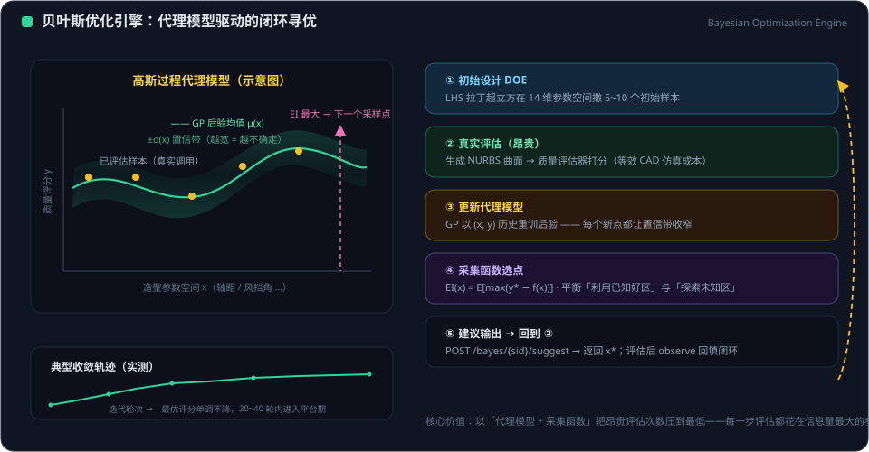

# 贝叶斯优化模块使用文档

> 模块定位：机器学习后台训练的**贝叶斯优化容器**。
> 在造型参数空间（车长 / 车宽 / 轴距等 14 参数）中，以高斯过程为代理模型、
> EI / UCB 为采集函数自动寻优；观测样本可导出为与 `/ai/train` 数据集兼容的训练格式。
>
> 源码实现：
> - 引擎：`backend/app/bayes_optimizer.py`（纯 numpy + scipy，无新增重依赖）
> - 路由：`backend/app/routes/bayes.py`
> - 前端 SDK：`src/api.js` 中的 `bayesAPI`

---

## 1. 工作原理与使用闭环

<figure class="doc-figure">
  
  <figcaption>图 1-1 ｜ 贝叶斯优化闭环：GP 代理模型（左）与五步迭代（右）</figcaption>
</figure>

**闭环（建议 → 评估 → 回填 → 收敛 → 导出）**：

1. 创建寻优会话（参数空间、目标方向、采集函数）
2. `suggest` 获得引擎建议的下一组造型参数
3. 用该组参数评估造型质量分（如调用 `/ai/evaluate-quality`、实车仿真，或人工评分）
4. `observe` 把「参数 → 质量分」回填给引擎，代理模型随即更新
5. 重复 2–4，GP 对参数空间的认识逐渐收敛到最优区域
6. `best` 查看当前最优解；`samples` 导出全部观测作为训练数据

**算法行为**：

- 会话观测数 < 2 时，`suggest` 做随机空间填充（代理模型尚未稳定）；
  达到 2 个观测后切换为 GP 驱动的采集函数寻优。
- 无论目标为 maximize 还是 minimize，引擎内部统一转为最大化处理（minimize 对 score 取负）。
- 会话存储为**进程内内存**（与 training 任务管理一致的模式），后端重启后会话清空，
  请在需要留存时通过 `samples` 导出。

---

## 2. 快速上手（完整示例）

以下示例使用默认 14 参数空间、最大化目标、EI 采集函数：

```bash
# 1) 创建会话
curl -X POST http://localhost:8000/api/v1/bayes/sessions \
  -H "Content-Type: application/json" \
  -d '{"name": "sport-proportion", "seed": 42}'
# → 201，记录返回的 session_id（下文以 $SID 代替）

# 2) 建议一组参数
curl "http://localhost:8000/api/v1/bayes/sessions/$SID/suggest"

# 3) 用建议参数评估质量分（以 /ai/evaluate-quality 或人工评分为例）后回填
curl -X POST http://localhost:8000/api/v1/bayes/sessions/$SID/observe \
  -H "Content-Type: application/json" \
  -d '{"parameters": {"overall_length": 4600, "overall_width": 1980}, "score": 88.5}'
# 注意：observe 要求 parameters 包含空间内【全部】参数，示例仅示意字段结构

# 4) 多轮迭代后查看最优
curl http://localhost:8000/api/v1/bayes/sessions/$SID/best

# 5) 导出训练样本
curl http://localhost:8000/api/v1/bayes/sessions/$SID/samples
```

前端使用 `bayesAPI`（详见第 5 节）即可完成同样闭环。

---

## 3. API 参考

所有端点前缀：`/api/v1/bayes`；请求 / 响应均为 JSON。
当前端点未强制鉴权，可直接调用。

### 3.1 创建会话

`POST /sessions`

请求体（所有字段可选）：

| 字段 | 类型 | 默认 | 说明 |
|---|---|---|---|
| `name` | string | `""` | 会话名称 |
| `space` | array | 默认 14 参数空间 | 参数定义列表，元素为 `{name, min, max}` |
| `goal` | string | `"maximize"` | 目标方向：`maximize` / `minimize` |
| `acquisition` | string | `"ei"` | 采集函数：`ei` / `ucb` |
| `seed` | integer | 无 | 随机种子，用于复现实验 |

响应：`201 Created`

```json
{
  "session_id": "a1b2c3d4e5f6",
  "name": "sport-proportion",
  "goal": "maximize",
  "acquisition": "ei",
  "n_observations": 0,
  "space": [{"name": "overall_length", "min": 4000.0, "max": 6200.0}],
  "best": null
}
```

错误：参数空间为空、参数名重复、或存在 `max <= min` 时返回 `400`。

### 3.2 查询会话摘要

`GET /sessions/{session_id}` → 返回与创建时相同结构的摘要（含实时 `best`）。会话不存在返回 `404`。

### 3.3 删除会话

`DELETE /sessions/{session_id}` → `{"deleted": "<session_id>"}`；不存在返回 `404`。

### 3.4 建议采样参数

`GET /sessions/{session_id}/suggest?n=1`

| 查询参数 | 类型 | 默认 | 范围 | 说明 |
|---|---|---|---|---|
| `n` | integer | 1 | 1–32 | 一次建议的参数组数量，按采集值排序 |

响应：

```json
{
  "session_id": "a1b2c3d4e5f6",
  "acquisition": "ei",
  "suggestions": [
    {"overall_length": 4587.3, "overall_width": 1972.8}
  ]
}
```

所有建议值保证落在参数空间边界内。会话不存在返回 `404`。

### 3.5 上报观测

`POST /sessions/{session_id}/observe`

请求体：

| 字段 | 类型 | 说明 |
|---|---|---|
| `parameters` | object | 参数名 → 参数值，**必须覆盖空间内全部参数** |
| `score` | number | 该组参数的质量评分（目标函数值） |

响应：

```json
{
  "session_id": "a1b2c3d4e5f6",
  "index": 3,
  "n_observations": 4,
  "best": {"index": 2, "parameters": {}, "score": 91.2}
}
```

错误（均为 `400`）：参数名未知、参数缺失、参数值超出边界。会话不存在返回 `404`。

### 3.6 查询当前最优

`GET /sessions/{session_id}/best`

响应：`{"session_id", "index", "parameters", "score"}`，`index` 为最优观测的序号。
`goal=minimize` 时返回 score 最小的观测。会话尚无观测返回 `409`，会话不存在返回 `404`。

### 3.7 导出训练样本

`GET /sessions/{session_id}/samples`

响应：

```json
{
  "session_id": "a1b2c3d4e5f6",
  "feature_order": ["overall_length", "overall_width"],
  "goal": "maximize",
  "samples": [
    {"features": {"overall_length": 4600.0, "overall_width": 1980.0}, "score": 88.5}
  ]
}
```

`feature_order` 为特征参数名顺序，可直接用于对齐训练管线的特征列；
`features` 为参数名 → 参数值，`score` 为对应观测分。

---

## 4. 默认参数空间

不传 `space` 时使用以下 14 个造型参数（与训练管线 PARAM_ORDER 对齐；
长度单位 mm，角度单位度）：

| 参数 | 含义 | 下界 | 上界 |
|---|---|---:|---:|
| `overall_length` | 整车长度 | 4000 | 6200 |
| `overall_width` | 整车宽度 | 1750 | 2150 |
| `overall_height` | 整车高度 | 1100 | 2050 |
| `wheel_base` | 轴距 | 2400 | 3700 |
| `track_width` | 轮距 | 1450 | 1900 |
| `ground_clearance` | 离地间隙 | 80 | 280 |
| `hood_length` | 发动机盖长度 | 700 | 1700 |
| `roof_height` | 车顶高度 | 300 | 1050 |
| `wheel_diameter` | 轮毂直径 | 600 | 850 |
| `windshield_angle` | 前风挡角度 | 18 | 50 |
| `rear_window_angle` | 后风挡角度 | 10 | 50 |
| `rear_slant_angle` | 后倾角度 | 5 | 55 |
| `front_overhang` | 前悬长度 | 750 | 1150 |
| `rear_overhang` | 后悬长度 | 850 | 1350 |

自定义空间示例：一维寻优空间 `{"space": [{"name": "x", "min": 0, "max": 1}]}`。
所有参数均为连续值；参数名不可重复。

---

## 5. 前端 SDK（bayesAPI）

`src/api.js` 导出 `bayesAPI`，方法与端点一一对应：

| 方法 | 对应端点 |
|---|---|
| `createSession(data)` | `POST /bayes/sessions` |
| `getSession(sid)` | `GET /bayes/sessions/{sid}` |
| `deleteSession(sid)` | `DELETE /bayes/sessions/{sid}` |
| `suggest(sid, n = 1)` | `GET /bayes/sessions/{sid}/suggest` |
| `observe(sid, parameters, score)` | `POST /bayes/sessions/{sid}/observe` |
| `best(sid)` | `GET /bayes/sessions/{sid}/best` |
| `samples(sid)` | `GET /bayes/sessions/{sid}/samples` |

调用示例：

```js
import { bayesAPI } from '@/api'

const { data: session } = await bayesAPI.createSession({ goal: 'maximize', seed: 42 })
const { data: { suggestions } } = await bayesAPI.suggest(session.session_id)
// ... 评估 suggestions[0] 得到 score ...
await bayesAPI.observe(session.session_id, suggestions[0], score)
const { data: best } = await bayesAPI.best(session.session_id)
```

---

## 6. 采集函数与调参说明

| 项目 | 当前值 / 行为 | 调整效果 |
|---|---|---|
| GP 核函数 | RBF（各向同性长度尺度 0.25，归一化空间） | 长度尺度越大，代理模型越平滑；越小，对局部变化越敏感 |
| GP 噪声 | 1e-6（观测视为精确值） | 评分含噪声时可增大，避免模型过拟合观测点 |
| EI 最小改进 `xi` | 0.01 | 增大 → 更鼓励探索未采样区域 |
| UCB 权重 `kappa` | 2.0 | 增大 → 探索（不确定性）权重更高；减小 → 更偏向当前已知优区 |
| 冷启动观测数 | 2 | 此前随机空间填充，此后 GP 寻优 |
| 候选池 | 4096 个随机点 | 采集函数在候选池中取最大值，池越大逼近越精确、耗时略增 |

采集函数选择建议：

- **EI**（默认）： exploitation / exploration 平衡稳健，目标函数平滑时收敛快。
- **UCB**：通过 `kappa` 显式调节探索强度，适合多峰或想主动扩大采样覆盖面的场景。

---

## 7. 与训练模块联动

1. 贝叶斯会话的观测通过 `GET /samples` 导出，`features` 字段名与训练管线特征列一致，
   可直接构造训练数据集。
2. 闭环中的目标函数可由现有分析端点承担：`POST /api/v1/ai/evaluate-quality`
   提供造型参数的工程代理质量分。
3. 建议使用流程：先用少量贝叶斯迭代获得高质量、分布在优区附近的样本，
   再交给 `POST /api/v1/ai/train` 后台 PyTorch 训练，提升样本利用率。

---

## 8. 错误码速查

| 状态码 | 触发场景 |
|---|---|
| `400` | 创建会话时空空间 / 参数名重复 / `max <= min`；上报观测时参数未知、缺失或越界 |
| `404` | 会话不存在（查询 / suggest / observe / best / samples / 删除） |
| `409` | 无观测数据时查询 `best` |
| `422` | 请求体类型或字段值不符合 schema（如 goal/acquisition 取非法枚举） |

---

## 9. 测试

后端测试：`backend/tests/test_bayes.py`（12 例），覆盖：

- 会话生命周期：创建（默认 14 参数 / 自定义空间）、摘要查询、删除
- 采样建议落在边界内；观测上报的参数校验（未知 / 越界）
- `best` 在 maximize / minimize 下的方向正确性；无观测时 409
- **收敛性**：EI / UCB 对一维目标 `-(x-0.7)²` 各做 15 轮闭环，最优分 > -0.01
- 训练样本导出格式与字段顺序

运行方式：在 `backend/` 目录执行 `python -m pytest tests/test_bayes.py -q`。
前端路由契约测试位于 `src/tests/api.spec.js`。
