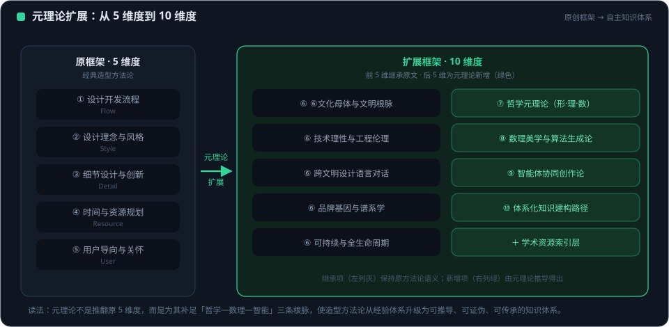
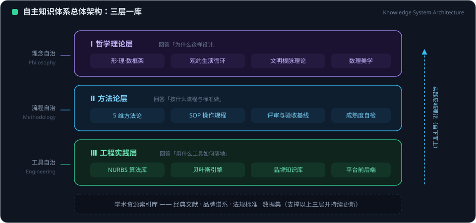

# 中国汽车造型设计自主知识体系——元理论扩展与体系构建

> **文档来源**：本文于 2026-09-27 引入项目，原件位于
> `D:\API\Research\Automotive\02-AI-3D-Tools\中国汽车造型设计自主知识体系_元理论扩展版.md`，
> 作为 EVOLUTION AI 平台设计哲学与造型知识体系的元理论参考。
> 配图（方法论元理论脑图、ComfyUI 风格知识底座图）存于同目录，未随本文引入。

---

## 一、元理论的概念与层次

### 1.1 元理论的定义

**元理论（Meta-theory）** 是"关于理论的理论"，重在把握理论如何被构建、验证、解释和应用，探索理论背后的哲学基础、认知逻辑、文化预设及其固有局限。它是理论构建的前提性知识，包含基本信念、自然秩序理想、合规律性与合目的性的统一等要素。

> 引自张宗登《设计史·设计批评·设计实践：设计学元理论的三个层级》："元理论是源于人类追求理解和逻辑思辨的本性而产生的一种具有普遍性意义的知识现象和知识形式。"

### 1.2 元理论的四层哲学根基

基于潘鲁生对中华传统造物艺术元理论的研究，以及Love的设计理论元理论层级结构，元理论包含四个哲学维度：

| 维度 | 核心问题 | 西方范式 | 中国范式 |
|------|----------|----------|----------|
| **本体论** | 世界本质是什么？ | 物质还原论、机械宇宙观 | 生生不息的有机生命观，万物由"气"生成并相互感应 |
| **认识论** | 如何获得认知？ | 逻辑实证、主客二分 | 具身认知，以身为度去体悟自然，心物交融、格物致知 |
| **方法论** | 如何开展实践？ | 改造自然、工具理性、效率最大化 | 顺应天道，法天象时、器以载道，巧法造化、技进乎道 |
| **价值论** | 追求何种终极价值？ | 绝对真理、彼岸救赎 | 日用即道，个体生命融入宇宙大化流行的永恒创生之流 |

### 1.3 元理论的九层抽象层级（Love框架扩展）

Terence Love提出的设计理论元理论层级结构，为汽车造型设计知识体系的分层提供了学术框架：

| 层级 | 分类 | 在汽车造型设计中的对应 |
|------|------|------------------------|
| **L1** | 本体论 | 中国造物哲学：天人共生、器以载道、气韵生动 |
| **L2** | 认识论 | 造型认知理论：体量→形面特征→图形元素的三层认知结构 |
| **L3** | 一般设计理论 | 汽车造型设计系统论：艺术与科学的统一、不确定性/复杂性 |
| **L4** | 设计者内部过程理论 | 设计师的"具身认知"、心传默会、文化直觉 |
| **L5** | 设计过程结构理论 | 造型开发流程：前期研究→造型设计→工程开发 |
| **L6** | 设计方法理论 | 形状文法、形态分析法、类型学、R角规制法 |
| **L7** | 选择机制理论 | 设计评审、客户评审、方案优化决策机制 |
| **L8** | 元素行为理论 | 造型特征行为：特征线遗传、品牌基因表达 |
| **L9** | 初概念形成 | 造型意象命名、色彩体系（"吉利清"）、纹样转译 |

### 1.4 设计学元理论的三个层级（张宗登框架）

张宗登提出设计学元理论包含三个层级，构成完整的学科体系：

- **设计史**：多元性、史实性、思想性——启发设计实践，为设计批评提供佐证史料
- **设计批评**：价值判断、审美评价、文化审视——提供价值标尺和审美标准
- **设计实践**：人本性、生态性、创造性——理论与实践的统一

> 这三个层级在汽车造型设计中的映射：中国汽车造型设计史（从模仿到自主）、造型批评（审美分野地图、九大原则）、造型实践（开发流程与技术创新）

---

## 二、原有框架的扩展——从5维度到10维度

<figure class="doc-figure">
  
  <figcaption>图 2-1 ｜ 元理论扩展：原 5 维度到 10 维度的映射关系</figcaption>
</figure>

思维导图以"汽车造型设计开发方法论元理论"为核心，从**设计开发流程、设计理念与风格、细节设计与技术创新、时间与资源规划、用户导向与关怀**五大维度展开。基于全网搜索，扩展为**十维度自主知识体系**：

### 2.1 原有5维度（保留深化）

| 维度 | 原有内容 | 深化扩展 |
|------|----------|----------|
| **① 设计开发流程** | 前期研究→造型设计→工程开发 | 增加"数字孪生与AI协同设计"环节，嵌入CAS/VR/A面数字流程 |
| **② 设计理念与风格** | 仿生与力量、简洁与一致、功能与动感、内外一体 | 增加中国美学范式：气韵生动、温润内敛、天人共生 |
| **③ 细节设计与技术创新** | 照明技术、车门创新、色彩表面、人机交互 | 增加"中国R角规制"、"中国色彩体系"、"纹样转印体系" |
| **④ 时间与资源规划** | 用时窗口、组装逻辑、周期参考 | 增加"设计熵增对抗"原则，流程衔接的系统效率 |
| **⑤ 用户导向与关怀** | 视野优化、触觉操作、功能实用 | 增加"情绪价值优先"、"审美最大公约数"、"文化地理学用户研究" |

### 2.2 新增5维度（自主知识体系核心）

#### ⑥ 元理论与哲学根基（新增）

**这是整个知识体系的第一层根基，决定了"为什么这样设计"的根本逻辑。**

| 子维度 | 内容 |
|--------|------|
| 本体论基础 | 天人共生——造物不是征服自然，而是参与和融入；气化生成——万物由"气"聚散成形，造型是气的流动与凝聚 |
| 认识论基础 | 具身认知——设计师以身为度体悟造型；心物交融——格物致知而非纯粹逻辑推演 |
| 方法论基础 | 巧法造化——顺应物性、因材施艺；器以载道——造型承载伦理与价值 |
| 价值论基础 | 日用即道——日常用车场景中的生命升华；技进乎道——技术实践即修身 |

> 核心命题：**中国汽车造型设计不是"改造自然"的工程行为，而是"参与宇宙生命循环"的造物行为。**

#### ⑦ 造物传统与文化根脉（新增）

**从文化源流为造型设计提供"精神DNA"。**

| 子维度 | 内容 |
|--------|------|
| **考工记体系** | 天有时、地有气、材有美、工有巧——合此四者然后可以为良。映射到汽车：天时（时代语境）、地气（在地性审美）、材美（材料创新）、工巧（制造精度） |
| **天工开物精神** | 天工在前、人巧在后——强调技术顺应自然规律而非对抗；电动化时代的"天工"是电池与电驱的自然属性 |
| **谢赫六法转译** | 气韵生动→整车体量的生命力表达；骨法用笔→特征线的力度与结构；应物象形→形态的仿生与功能回应；随类赋彩→中国色彩体系的构建；经营位置→比例与空间布局的秩序感；传移模写→品牌造型基因的代际传承 |
| **中国用户审美分野地图** | 华北·豪迈（燕赵文化）；川渝·锋锐（巴蜀文化）；岭南·多元（兼容并蓄）；江南·温润（君子文人）；西北·雄浑质朴 |
| **器以载道** | 造型不只是美学，更是身份认同、文化归属与生活方式的载体 |

#### ⑧ 造型领域知识体系（新增）

**基于赵江洪《汽车造型设计：理论、研究与应用》的学术框架，构建造型知识的系统分类。**

| 子维度 | 内容 |
|--------|------|
| **情境知识** | 市场语境、品牌语境、文化语境——基于案例的情境知识模型构建 |
| **领域知识（对象知识）** | 造型特征的获取与表征；造型领域概念模型；定性定量转化的案例知识应用 |
| **任务知识（过程知识）** | 设计过程的任务分解、获取与建模；基于任务的计算机辅助概念设计 |
| **造型特征体系** | 特征线——整体造型的骨架与信息载体；造型基因——核心信息的代际遗传 |
| **造型格式塔** | 整体-局部的认知完形关系；体量(Volume)→象征语义/抽象语义 |
| **造型主题** | 设计意图的叙事化表达；形面特征(Treatment)→索引语义；图形元素(Graphic)→图标语义 |
| **造型认知三层结构** | 体量层（整体审美认知）→形面层（造型语言与手法）→图形层（视觉识别优势） |

#### ⑨ 设计原则与价值主张（新增）

**从吉利九大原则扩展为行业级的中国汽车设计原则体系。**

| 原则 | 含义 | 理论根基 |
|------|------|----------|
| **根植品牌文化内核** | 设计语言随时代迭代，核心内涵始终不变 | 器以载道 |
| **根植技术发展** | 设计必须回应电动化、智能化的技术特征 | 天工开物·天工在前 |
| **根植用户需求** | 从文化地理学出发，回应在地性审美 | 天有时、地有气 |
| **追求审美最大公约数** | 在多元审美中找到共识，而非追求某种"统一风格" | 日用即道 |
| **工必有意** | 每一处设计布局兼具功能与意图 | 技进乎道 |
| **对抗设计的熵增** | 在复杂环境中保持判断一致性，约束即自由 | 造物伦理·重己役物 |
| **在车中设计车** | 设计不是外在于车的"包装"，而是参与产品定义 | 具身认知 |
| **有温度的秩序** | 冰冷的工业产品拥有人文温度，秩序通达情感 | 心性伦理·以技养心 |
| **品质决定价值** | 精致感与高级感是长期主义的基石 | 材有美、工有巧 |

> 陈政的中国设计三问：①文化内核是否根植而非元素堆砌？②能否建立文化主体性的设计范式？③能否从制造规模蜕变为价值范式？

#### ⑩ 中国造型语言与范式体系（新增）

**将"气韵生动"的感性认知转化为可量化、可应用、可传承的造型规制。**

| 子维度 | 内容 |
|--------|------|
| **中国R角规制体系** | 从古建筑、传统器物（瓷器、家具）的曲率特征中提取，将"气韵生动"转化为可传承的R角规则；上百种曲率转折组合，既符合空气动力学又兼具东方器物的温润质感 |
| **中国色彩体系** | 以水为仪、以情为表——"吉利清"色号从四个维度系统规律构建；突破西方CMYK/RGB的量化逻辑，关联文化内涵 |
| **中国纹样转印体系** | 山水、祥瑞、节气、书法、器物、民俗六大文化主题；传统纹样走出博物馆融入用车场景 |
| **中国比例与空间范式** | "三进大空间"——豪气、贵气、从容；温润内敛的整车比例关系 |
| **品牌造型基因图谱** | 造型特征的遗传图——从捕食者外观到温润君子，品牌DNA的代际传承 |
| **型面语义与光影解构** | 找形→塑形→品牌基因符号；高级感和精致感的型面表达 |

---

## 三、知识体系的总体架构

<figure class="doc-figure">
  
  <figcaption>图 3-1 ｜ 自主知识体系「三层一库」总体架构</figcaption>
</figure>

### 3.1 三层架构图

```
┌─────────────────────────────────────────────────────────────┐
│                  元理论层（L1-L2）                            │
│  ┌──────────┐ ┌──────────┐ ┌──────────┐ ┌──────────┐       │
│  │ 本体论    │ │ 认识论    │ │ 方法论    │ │ 价值论    │       │
│  │天人共生   │ │具身认知   │ │巧法造化   │ │日用即道   │       │
│  │气化生成   │ │心物交融   │ │器以载道   │ │技进乎道   │       │
│  └──────────┘ └──────────┘ └──────────┘ └──────────┘       │
├─────────────────────────────────────────────────────────────┤
│                  理论层（L3-L7）                              │
│  ┌───────────────────────────────────────────────────────┐  │
│  │ 设计学三元：设计史·设计批评·设计实践                    │  │
│  ├───────────────────────────────────────────────────────┤  │
│  │ 汽车造型知识三元：情境知识·领域知识·任务知识            │  │
│  ├───────────────────────────────────────────────────────┤  │
│  │ 造型认知三层：体量语义·形面语义·图形语义                │  │
│  ├───────────────────────────────────────────────────────┤  │
│  │ 设计原则九条：根植品牌·根植技术·根植用户·审美公约·      │  │
│  │ 工必有意·对抗熵增·在车中设计车·温度秩序·品质定价值     │  │
│  └───────────────────────────────────────────────────────┘  │
├─────────────────────────────────────────────────────────────┤
│                  应用层（L8-L9）                              │
│  ┌──────────┐ ┌──────────┐ ┌──────────┐ ┌──────────┐       │
│  │ 开发流程  │ │ 造型语言  │ │ 技术创新  │ │ 用户关怀  │       │
│  │前期研究   │ │中国R角    │ │照明技术   │ │情绪价值   │       │
│  │造型设计   │ │中国色彩   │ │车门创新   │ │审美分野   │       │
│  │工程开发   │ │纹样转印   │ │人机交互   │ │触觉操作   │       │
│  │数字孪生   │ │品牌基因   │ │材料创新   │ │功能实用   │       │
│  └──────────┘ └──────────┘ └──────────┘ └──────────┘       │
└─────────────────────────────────────────────────────────────┘
```

### 3.2 十维度知识体系矩阵

| 维度编号 | 维度名称 | 核心理论来源 | 关键知识要素 |
|----------|----------|-------------|-------------|
| ① | 设计开发流程 | 赵江洪设计系统论；东风数智化实践 | 前期研究→造型设计→工程开发→数字孪生 |
| ② | 设计理念与风格 | 谢赫六法转译；吉利设计原则 | 气韵生动、温润内敛、天人共生、内外一体 |
| ③ | 细节设计与技术创新 | 形状文法；中国R角研究 | R角规制、色彩体系、纹样转印、照明交互 |
| ④ | 时间与资源规划 | Love选择机制理论；设计熵增对抗 | 流程衔接、用时窗口、设计决策效率 |
| ⑤ | 用户导向与关怀 | 审美分野地图；情绪价值优先 | 审美公约、文化地理学、触觉操作、视野优化 |
| ⑥ | 元理论与哲学根基 | 潘鲁生造物元理论；Love九层框架 | 本体论→认识论→方法论→价值论 |
| ⑦ | 造物传统与文化根脉 | 考工记·天工开物·谢赫六法 | 天时地气材美工巧、审美分野地图、器以载道 |
| ⑧ | 造型领域知识体系 | 赵江洪《汽车造型设计：理论、研究与应用》 | 情境知识·领域知识·任务知识·造型基因 |
| ⑨ | 设计原则与价值主张 | 吉利设计九大原则；陈政三问 | 九大原则、审美公约、温度秩序 |
| ⑩ | 中国造型语言与范式 | 中国R角研究；型面语义学；品牌基因图谱 | R角规制、色彩体系、纹样体系、比例范式 |

---

## 四、核心学术资源索引

### 4.1 元理论与设计哲学

| 来源 | 核心贡献 | 对本体系的作用 |
|------|----------|---------------|
| Terence Love《A Meta-Theoretical Basis for Design Theory》 | 设计理论9层抽象层级结构 | 提供知识体系分层逻辑 |
| 张宗登《设计史·设计批评·设计实践：设计学元理论的三个层级》 | 设计学三元理论结构 | 提供学科体系框架 |
| 潘鲁生·殷波《关于中华传统造物艺术体系研究的再认识》 | 中华造物元理论四维度 | 提供中国范式哲学根基 |

### 4.2 汽车造型设计理论

| 来源 | 核心贡献 | 对本体系的作用 |
|------|----------|---------------|
| 赵江洪等《汽车造型设计：理论、研究与应用》 | 首部汽车造型理论专著；情境/领域/任务知识三分；造型特征/基因/格式塔/主题体系 | 提供造型知识分类框架 |
| 汽车造型认知三层结构 | 体量(Volume)→形面特征(Treatment)→图形元素(Graphic) | 提供造型认知结构 |
| 品牌造型基因研究 | 造型基因遗传图、组系图谱 | 提供品牌传承理论工具 |
| 形状文法/形态分析法 | 形态生成规则、遗传与变异规则 | 提供造型方法工具 |

### 4.3 中国设计实践与原则

| 来源 | 核心贡献 | 对本体系的作用 |
|------|----------|---------------|
| 吉利设计九大原则（陈政） | 根植品牌/技术/用户、审美公约、工必有意、对抗熵增、在车中设计车、温度秩序、品质定价值 | 提供中国设计原则体系 |
| 中国用户审美分野地图 | 华北豪迈·川渝锋锐·岭南多元·江南温润·西北雄浑 | 提供文化地理学用户研究 |
| 中国R角研究 | 气韵生动→可量化R角规制 | 提供中国造型语言转译方法 |
| 中国色彩体系"吉利清" | 以水为仪、以情为表 | 提供中国色彩范式 |

### 4.4 中国传统造物美学

| 来源 | 核心贡献 | 对本体系的作用 |
|------|----------|---------------|
| 《考工记》 | 天有时·地有气·材有美·工有巧 | 提供造物总原则 |
| 《天工开物》 | 天工在前·人巧在后 | 提供技术观 |
| 谢赫六法 | 气韵生动·骨法用笔·应物象形·随类赋彩·经营位置·传移模写 | 提供造型审美转译框架 |
| 张道一《造物的艺术论》 | 本元文化论·物质与精神统一 | 提供造物哲学基础 |

### 4.5 高校研究力量

| 机构 | 代表人物 | 研究方向 |
|------|----------|----------|
| 湖南大学·汽车车身先进设计制造国家重点实验室 | 赵江洪、谭浩、谭征宇、赵丹华 | 造型特征/基因/知识模型/智能设计 |
| 清华大学美术学院·交通工具造型设计 | 柳冠中、刘新、张雷 | 设计哲学/系统论/产学研 |
| 同济大学·车辆工程与工业设计联合 | 李彦龙、娄永琪、常炜 | 跨学科培养/汽车美学/造型与空气动力学 |
| 吉林大学·车身学科 | 肖宏伟 | 汽车造型美学评价 |

---

## 五、从"元理论"到"自主知识体系"的建构路径

### 5.1 三阶段演进

```
阶段一：根基建构 ──→ 阶段二：体系化 ──→ 阶段三：价值输出
  （根脉·主张）      （特征·范式）      （全球审美引领）

├─ 文化根脉梳理     ├─ 设计原则确立     ├─ 从制造规模→价值范式
│  审美分野地图     │  九大原则体系     │  中国设计被理解·被欣赏·被追随
│  考工记·谢赫六法  │  中国R角规制     │  跨越行业与文化的造型语言
│  天工开物精神     │  中国色彩体系     │
└─ 元理论四维度     └─ 造型语言范式     └─ 全球设计话语权
```

### 5.2 核心命题体系

**中国汽车造型设计自主知识体系的核心命题：**

1. **造物不是征服，而是参与** —— 本体论命题
2. **认知不是逻辑，而是具身** —— 认识论命题  
3. **方法不是效率，而是造化** —— 方法论命题
4. **价值不是参数，而是众生** —— 价值论命题
5. **设计不是包装，而是定义** —— 实践命题
6. **风格不是堆砌，而是根脉** —— 文化命题
7. **原则不是束缚，而是自由** —— 方法命题
8. **基因不是模仿，而是传承** —— 知识命题

---

## 六、与原思维导图的对照：扩展维度详解

原思维导图的5维度 → 扩展后的10维度对照关系：

| 原维度 | 扩展后保留 | 新增关联维度 | 扩展内容摘要 |
|--------|-----------|-------------|-------------|
| 设计开发流程 | ①深化 | ⑥元理论（L5-L7层） | 数字孪生环节嵌入；选择机制理论深化评审逻辑 |
| 设计理念与风格 | ②深化 | ⑦文化根脉·⑩造型语言 | 中国美学范式注入；谢赫六法转译；气韵生动→R角规制 |
| 细节设计与技术创新 | ③深化 | ⑧造型知识·⑩造型范式 | 造型基因替代单纯"技术创新"；中国色彩/纹样体系 |
| 时间与资源规划 | ④深化 | ⑨设计原则 | "对抗熵增"原则注入；系统效率而非单纯时间管控 |
| 用户导向与关怀 | ⑤深化 | ⑦文化根脉·⑨设计原则 | 审美分野地图注入；情绪价值优先取代功能实用主义 |

---

## 七、结语：中国汽车造型设计自主知识体系的愿景

中国汽车造型设计的自主知识体系，不是西方设计理论的"本土化改装"，而是从中国造物哲学的根脉出发，建立具有文化主体性的理论范式。其核心逻辑链：

> **元理论（本体/认识/方法/价值）→ 造物传统（考工记/天工开物/谢赫六法）→ 设计原则（九大原则）→ 造型语言（R角/色彩/纹样/基因）→ 全球审美输出**

当更多中国品牌找到自身设计根脉与主张，当全行业共同构建起完整的中国设计话语体系，中国设计终将从"制造符号"蜕变为"价值范式"——这不是一家企业的独角戏，而是中国品牌全行业的集体长征。

---

*本知识体系基于：Terence Love元理论框架、张宗登设计学三元理论、潘鲁生中华造物元理论、赵江洪汽车造型知识体系、陈政吉利设计九大原则、考工记/天工开物/谢赫六法等传统美学资源，经系统性整合与扩展而成。*
