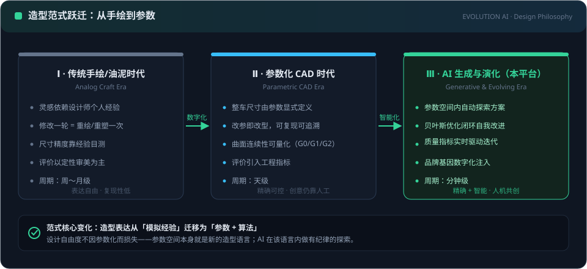
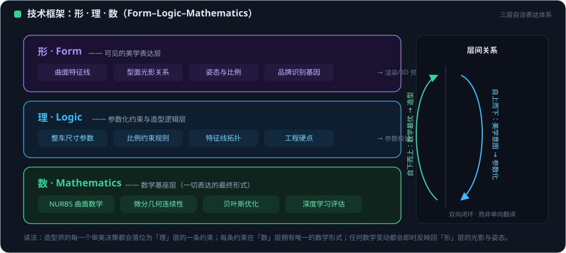
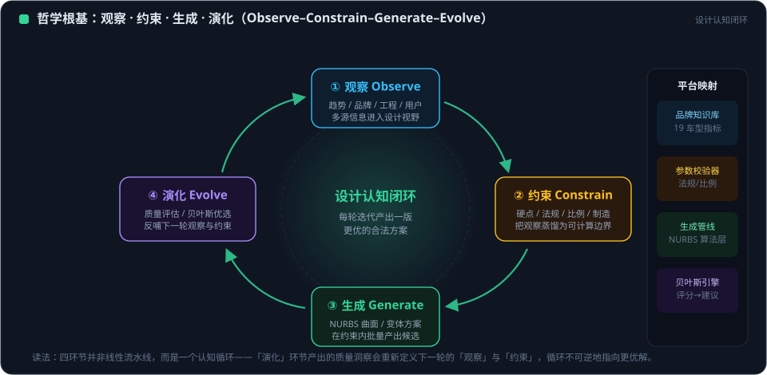
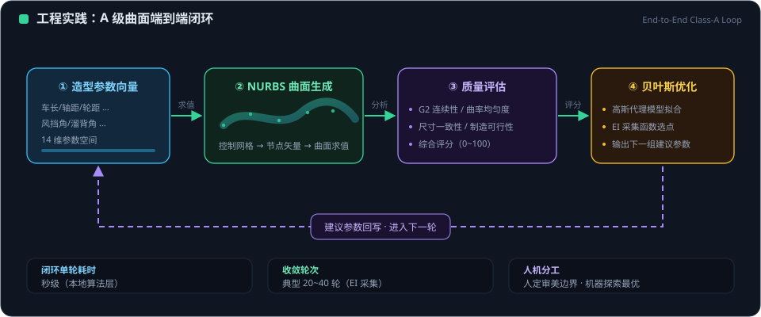

# EVOLUTION AI 汽车造型设计哲学

> 文档编号：EVOLUTION-AI-DPHIL-2026
> 版本：4.0（2026-09-27，在 v3.0《EVOLUTION AI 汽车造型设计哲学》基础上对齐平台现状）
> 适用范围：AI 时代汽车 A 级曲面设计方法论、特征线/参数驱动建模、数字孪生与智能协同开发
> 历史版本：v3.0（2026 年 7 月）原件存于 `D:\API\Research\Automotive\02-AI-3D-Tools\`

---

## 目录

1. 核心理念：从手绘到参数的范式跃迁
2. 技术框架：形 · 理 · 数
3. 哲学根基：观察 · 约束 · 生成 · 演化
4. 人文温度：哲学与造型的双螺旋
5. 工程实践：A 级曲面端到端闭环
6. 智能时代：贝叶斯、深度学习与 LLM 的哲学位置
7. 品牌基因：兼收并蓄的设计智慧
8. 未来展望

---

## 1. 核心理念：从手绘到参数的范式跃迁

<figure class="doc-figure">
  
  <figcaption><strong>图 1-1 ｜ 造型范式跃迁：手绘时代 → 参数化时代 → AI 生成与演化时代</strong>读图：三个时代卡片沿时间轴递进——手绘时代依赖个人经验、复现性低；参数化时代让尺寸显式可追溯、周期缩短至天级；AI 时代（本平台）在参数空间内自动探索并以质量指标驱动迭代，单轮周期压缩至分钟级。底部结论条点明范式核心：造型表达从「模拟经验」迁移为「参数 + 算法」。</figcaption>
</figure>

### 1.1 范式革命

传统汽车造型由手绘驱动：设计师用线条勾勒轮廓，工程师逆向构造曲面。EVOLUTION AI 开创了参数驱动的范式：

| 对比维度 | 传统手绘驱动 | EVOLUTION AI 参数驱动 |
|---|---|---|
| 设计起点 | 美学线条 | 物理硬点 |
| 驱动方式 | 主观创意 | 参数约束 |
| 曲面质量 | 人工校验 | 算法保障 |
| 迭代效率 | 周级 | 秒级 |
| 可追溯性 | 弱 | 全链路可追溯 |

### 1.2 三大原则

- **世界模型驱动**——汽车是功能与美学的统一体。参数空间的每个维度映射真实物理约束（空气动力学、人体工程学、制造工艺）。
- **自主学习进化**——22 维参数空间与品牌基准车型构成初始知识库，通过持续质量评估反馈实现自主迭代。
- **持续优化闭环**——设计 → 建模 → 评估 → 反馈 → 参数调整，无限循环的质量提升。

### 1.3 从四层到五层

v3.0 的四层哲学架构，在平台时代扩展为承载 Web 协同与 AI 优化的完整体系：

```
┌──────────────────────────────────────┐
│  美学愿景层：品牌 DNA / 设计语言 / 情感 │
├──────────────────────────────────────┤
│  特征线/参数层：造型骨架与可计算意图     │
├──────────────────────────────────────┤
│  曲面工程层：NURBS / G2 连续 / A 级标准 │
├──────────────────────────────────────┤
│  智能优化层：贝叶斯寻优 / DL / LLM 协同 │
├──────────────────────────────────────┤
│  参数空间层：22 维 CarParams / 硬点约束 │
└──────────────────────────────────────┘
```

---

## 2. 技术框架：形 · 理 · 数

<figure class="doc-figure">
  
  <figcaption><strong>图 2-1 ｜ 形 · 理 · 数三层表达体系与层间双向闭环</strong>读图：自上而下三层——紫色「形」层承载可见的美学表达（特征线/光影/姿态/品牌基因）；蓝色「理」层把每个审美决策落位为参数约束与硬点；绿色「数」层以 NURBS、微分几何、贝叶斯为数学基座。右侧双向箭头强调层间是闭环而非单向翻译：美学意图向下参数化，数学最优向上反哺造型。</figcaption>
</figure>

### 2.1 形（Form）——美学表达

形态由参数化的特征结构定义：侧视剪影、腰线（车身上下分界、动态感来源）、肩线（上部折线、肌肉感）、车顶轮廓、前后造型（品牌识别与力量感）、轮拱（运动感）、温室线（优雅感）、底部门槛（稳重感）。

### 2.2 理（Logic）——工程约束

| 约束域 | 核心内容 |
|---|---|
| 空气动力学 | Cd 值目标、气流分离控制 |
| 人体工程学 | H 点位置、视野范围、乘坐空间 |
| 制造工艺 | 冲压可行性、焊接精度、装配公差 |
| 法规合规 | 碰撞安全、灯光法规、行人保护 |

### 2.3 数（Mathematics）——精确描述

参数化建模链路：**22 维 CarParams → 参数化特征 → NURBS 曲面**。

22 维参数覆盖：主尺寸、区段长度、离地间隙、造型角度与弧度、玻璃深度、车轮与车灯细节。质量以 G0/G1/G2 连续性、反射线评分与综合等级（A/B/C/D）精确描述。

> 形、理、数不是三个阶段，而是同一件事的三个侧面：无理之形不可造，无数之理不可传，无形之数无意义。

---

## 3. 哲学根基：观察 · 约束 · 生成 · 演化

<figure class="doc-figure">
  
  <figcaption><strong>图 3-1 ｜ 观察—约束—生成—演化认知闭环及其平台模块映射</strong>读图：四个节点沿圆环顺时针循环——观察（多源信息进入视野）→约束（蒸馏为可计算边界）→生成（约束内批量产出候选）→演化（评估反哺下一轮）；中心强调每轮迭代产出一版更优的合法方案。右侧栏给出四环节与平台模块（品牌知识库/参数校验器/生成管线/贝叶斯引擎）的一一对应。</figcaption>
</figure>

### 3.1 跨文明的认知共鸣

东西方哲学路径不同，却在「认识世界 → 创造器物」的认知结构上殊途同归：

| 认知阶段 | 东方传统 | 西方传统 | EVOLUTION 的对应 |
|---|---|---|---|
| 观察 | 仰则观象于天——捕捉流动与韵律 | Plato's Forms——从现象提炼理念 | 参数与意象捕捉 |
| 约束 | 俯则观法于地——锚定结构与边界 | Aristotle's Physis——遵循自然法则 | 尺寸与硬点约束 |
| 生成 | 观象 → 得法 → 成器 | Hegel's Aufhebung——否定之否定的综合 | 参数 → 特征 → NURBS 成器 |
| 演化 | 变易——苟日新，日日新 | Darwinian Evolution——适应与优化 | 贝叶斯寻优与质量反馈 |

核心洞见：《周易》「观象制器」、古希腊「Eidos → Dynamis → Energeia」的形质论、近代控制论的「感知 → 决策 → 执行 → 反馈」，指向同一认知结构——**从观察中提炼规律，在约束中生成形态，于反馈中持续优化**。

### 3.2 层级的哲学映射

| 层级 | 东方隐喻 | 西方对应 | 技术实现 |
|---|---|---|---|
| 观象 | 仰观天象，捕捉流动韵律 | Empiricism：从经验提取规律 | 造型参数 |
| 法地 | 俯察地法，锚定空间逻辑 | Rationalism：从先验推导边界 | 尺寸/比例硬点 |
| 成器 | 以象制器，造物成形 | Pragmatism：观念须在实践中实现 | 特征 → NURBS 曲面 |
| 制变 | 变易不居，日新又新 | Cybernetics：反馈驱动自组织 | 贝叶斯优化与质量闭环 |

### 3.3 天人共生的本体立场

平台持有一个明确的本体立场：**造物不是征服自然，而是参与和融入**。参数不是用来"强加"形态于材料，而是顺应材料与物理的自然倾向去引导成形——这正是"巧法造化、技进乎道"。

---

## 4. 人文温度：哲学与造型的双螺旋

### 4.1 从"形何以立"到"形何以动人"

机械美学关注形何以立——结构、比例、连续性。人文温度追问形何以动人——这些结构为什么让人感到美、感到归属。

| 层面 | 机械美学 | 人文温度 |
|---|---|---|
| 问题 | 形何以立 | 形何以动人 |
| 尺度 | 参数与公差 | 情感与身份 |
| 达成 | G2 连续、反射线 | 温度的秩序、器以载道 |

### 4.2 有温度的秩序

冰冷的工业产品可以拥有人文温度，前提是秩序通达情感而非压制情感。平台把这一信念工程化为两条要求：

- **日用即道**：在真实用车场景中实现价值，而非为参数表设计；
- **信号优先**：能力不足时诚实告知——诚实本身就是对用户的尊重。

### 4.3 双螺旋

哲学与造型不是"先想清楚哲学、再做造型"的先后关系，而是相互缠绕的双螺旋：每一次造型决策都在回答哲学问题（为谁、为何、如何共处），每一个哲学命题都必须接受造型实践的检验。

---

## 5. 工程实践：A 级曲面端到端闭环

<figure class="doc-figure">
  
  <figcaption><strong>图 5-1 ｜ A 级曲面端到端闭环：参数 → NURBS 生成 → 质量评估 → 贝叶斯优化</strong>读图：水平主链为参数向量、NURBS 生成、质量评估、贝叶斯优化四步，紫色虚线环表示建议参数回写进入下一轮；底部三个指标条给出闭环单轮耗时（秒级）、典型收敛轮次（20–40 轮）与人机分工（人定审美边界、机器探索最优）。</figcaption>
</figure>

### 5.1 闭环结构

```
概念参数
   ↓
参数化建模（快速网格路径 / NURBS 精确路径，共享参数空间）
   ↓
质量评估（G0/G1/G2 + 反射线 + A/B/C/D 分级）
   ↓
AI 优化（硬点冻结后的局部光顺 / 贝叶斯全局寻优）
   ↓
工程交付（STEP / GLB 等导出，连续性偏差报告）
```

### 5.2 诚实的质量观

平台不讳言原始几何的不足：未经光顺的参考曲面在评估中得到 D 级，这恰恰说明质量标准是真实的门禁，而非装饰。参数化车身单侧网格可呈现"角度连续已较好（G2 比率 0.855）而曲率均匀度不足（反射线 0.158，综合 C 级）"的状态——这是造型收敛过程中的真实中间态。

### 5.3 硬点哲学

模拟退火光顺在连续、硬点主导的面板上改善有限，而在硬点冻结后的局部扰动区域效果可测。这背后是方法论次序：**先定结构，再修肌肤**。颠倒次序，优化就会在没有基准的空间里空转。

---

## 6. 智能时代：贝叶斯、深度学习与 LLM 的哲学位置

### 6.1 贝叶斯优化——"在不确定中理性行动"

贝叶斯方法的哲学内核与"观象制器"高度一致：在观测稀少、不确定真实目标形态时，先建立关于未知世界的信念（GP 代理模型），再以"探索与利用的平衡"（EI/UCB）决定下一步行动，并随每个新观测更新信念。

- 它不假设一次看全真理，而是承认认知的渐进性；
- 它把"下一个实验做什么"从直觉升级为可解释的理性决策；
- 观测样本回流为训练数据，形成认知—行动—再认知的循环。

### 6.2 深度学习——"从经验中学习形态"

深度学习承载"自主学习进化"原则：从样本中学习形态与评价的规律。平台同时警惕"伪学习"——依赖缺失时显式报不可用，绝不输出编造的指标。学习必须以证据为界。

### 6.3 LLM 专家——"知识的对话式在场"

NURBS 专家对话与多模型统一代理，让领域知识以对话方式在场，对应"心传默会"的知识传统在数字时代的延续。但专家建议是辅助而非裁决：最终价值判断仍由负责任的人做出。

### 6.4 可信原则：Signal, never simulate

三种智能能力共享一条伦理底线：**有信号，不模拟**。不可用时显式失败，降级路径清晰标注。对工具的信任，只能建立在其诚实之上。

---

## 7. 品牌基因：兼收并蓄的设计智慧

### 7.1 基因的传承

造型基因是核心信息的代际遗传：技术时代与审美在变，品牌的精神内核不变。平台以真实品牌基准车型库支持"从基因出发"的设计，而非凭空创造。

### 7.2 兼收并蓄

跨文明哲学研究本身就是品牌智慧的隐喻：不固守单一传统，也不堆砌文化符号，而是在理解各自主张后，做出有根的综合。**风格不是元素的堆砌，而是根脉的生长。**

### 7.3 文化主体性

真正的自主，不是拒绝外来影响，而是从自身文化根脉出发建立可被理解、被欣赏的设计范式——从制造规模走向价值范式。

---

## 8. 未来展望

- 造型参数将与草图、语言等更自然的意图入口融合，同时保留可编辑性；
- 代理模型将走向多保真度、可学习的长度尺度，支撑更高维的协同寻优；
- 真实优化战役的观测将持续沉淀为组织知识资产，并支撑可审计的模型演进；
- 设计哲学将持续在造型实践中被检验、被更新——哲学不是结论，而是一条与产品共同生长的路。

---

> **观象，法地，成器，制变。**
> 在观察中理解世界，在约束中生成形态，在反馈中持续进化，在造物中安放温度。

---

*本哲学文档与平台 v1.2 工程能力一一对应；操作层面见方法论，知识分层见元理论，验证证据见验证报告。*
