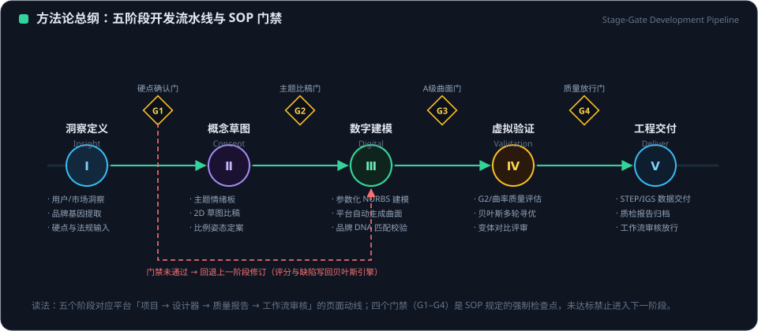

# EVOLUTION AI 造型开发方法论

> 版本：v1.2（2026-09-27）
> 文档编号：EVOLUTION-AI-METH-2026
> 定位：把平台能力转化为可执行的造型开发方法——流程怎么跑、工具怎么用、决策怎么做
> 与配套文档的关系：本文回答「怎么做」；[设计哲学](design_philosophy.md)回答「为什么」；[元理论](design_meta_theory.md)回答「知识如何分层」；[白皮书](whitepaper.md)回答「平台是什么」

---

## 1. 方法论总纲

<figure class="doc-figure">
  
  <figcaption>图 1-1 ｜ 五阶段开发流水线与 G1–G4 门禁（未通过即回退修订）</figcaption>
</figure>

### 1.1 一个主张

**从一句话到 3D 整车**：造型开发的本质，是把模糊的概念意图，经过受约束的生成与可量化的评估，逐步收敛为工程可交付的精确几何。

### 1.2 三个方法支点

| 支点 | 含义 | 在平台上的落点 |
|---|---|---|
| 参数即语言 | 用参数空间同时表达设计意图与工程硬点 | 22 维 CarParams + 14 维贝叶斯空间 |
| 闭环即流程 | 生成→评估→反馈→调整无限循环 | 设计器 + 质量中心 + 贝叶斯会话 |
| 证据即决策 | 一切方案比较基于可审计的数据 | 变体对比、质量报告、训练任务记录 |

### 1.3 方法论五维度

平台方法论围绕五个维度展开，覆盖一个真实造型项目的完整生命周期：

```
① 设计开发流程  —— 阶段如何划分与衔接
② 设计理念风格  —— 美学方向如何确立与一致
③ 细节与技术    —— 造型语言如何落地为工程
④ 时间与资源    —— 节奏、并行与决策效率
⑤ 用户与关怀    —— 为谁设计、如何验证
```

---

## 2. 维度一：设计开发流程

### 2.1 三阶段主流程

| 阶段 | 关键活动 | 平台工具 | 产出 |
|---|---|---|---|
| **前期研究** | 品牌语境、市场语境、用户研究、参考车型分析 | 演示中心、品牌车型知识库、用户审美研究 | 设计方向与参数基线 |
| **造型设计** | 参数输入、整车生成、方案比较、变体管理 | 设计器、项目/项目详情、深度学习 | 多方案 3D 模型与变体集 |
| **工程开发** | CAD 导入改参、质量检查、格式导出、交接 | 交付中心、质量中心、工作流 | A 级曲面与工程交付包 |

### 2.2 AI 协同的嵌入式流程

AI 不是流程末端的附加物，而是嵌入每个阶段：

| 阶段 | AI 角色 |
|---|---|
| 前期研究 | 车型知识库检索、纹理/风格语义分析（CLIP） |
| 造型设计 | 生成式设计、云端样本批次、贝叶斯寻优、LLM 专家对话 |
| 工程开发 | 连续性自动检查、质量自动分级、导出自动化 |

### 2.3 流程纪律

- **硬点先行**：尺寸、比例、姿态参数先冻结，再做局部光顺——否则优化与评估失去基准；
- **状态显式**：每个项目、任务、会话的状态必须来自系统数据，不允许口头状态；
- **可追溯**：每次参数变更与评分都应落到变体/记录，保证方案可回滚。

---

## 3. 维度二：设计理念与风格

### 3.1 风格确立的输入

- **品牌 DNA**：核心造型语言的代际传承（平台以真实品牌车型库为参照）；
- **技术特征**：电动化硬点（轴距占比、无前舱约束）塑造新比例；
- **文化语境**：中国美学范式（气韵生动、温润内敛）与用户审美分野。

### 3.2 风格一致性方法

| 方法 | 操作 |
|---|---|
| 参数基线 | 以品牌基准车型的 22 维参数作为方案起点，而非从零开始 |
| 主题命名 | 用叙事化主题统一团队对方向的理解 |
| 分镜表达 | 以视频分镜把风格意图转译为可视化沟通资产 |
| 比例控制 | 以参数边界（校验规则）约束偏离，防止风格漂移 |

### 3.3 内外一体

内饰与外饰共享同一设计语言系统：造型认知遵循「体量 → 形面特征 → 图形元素」的三层结构，风格统一在体量层先成立，再逐层下沉。

---

## 4. 维度三：细节设计与技术创新

### 4.1 造型语言的落地路径

```
美学意象（感性） → 参数化规则（可计算） → NURBS 曲面（可制造）
```

| 环节 | 平台方法 |
|---|---|
| 曲率/转角 | R 角规制思想 → 参数化截面与 NURBS 圆角曲面 |
| 曲面构造 | 放样/扫掠/混接/旋转 + G2 光顺 |
| 连续性 | 连续性检查器（0.1 mm / 1.0°）逐对输出偏差 |
| 纹理与装饰 | 参数化纹理分析（CLIP 六维语义）与应用 |
| 灯光/交互 | 灯具几何与语义分析结合 |

### 4.2 双几何路径

- **快速路径**：参数化截面网格，秒级生成，用于概念探索与方案比较；
- **精确路径**：NURBS 自由曲面 + STEP 导出，用于工程交付。
- 两条路径共享同一参数空间，保证"所见即所交付"。

### 4.3 质量内建

质量不是终检环节，而是构造规则的一部分：G2 光顺在曲面生成时即施加，质量分级在每次生成后即可获得，形成**质量驱动的迭代**。

---

## 5. 维度四：时间与资源规划

### 5.1 节奏与并行

| 原则 | 方法 |
|---|---|
| 秒级迭代 | 参数化整车生成与评估在秒级完成，方案数量不再受人力限制 |
| 并行工作 | 建模、训练、贝叶斯会话可并行推进（后台线程） |
| 异步收敛 | 训练/优化以任务方式运行，前端轮询状态而非阻塞等待 |

### 5.2 对抗流程熵增

复杂项目中，环境与意见会持续增加不确定性。方法对策：

- 以参数校验与边界规则约束方案空间（**约束即自由**）；
- 以可审计的评分作为选择机制，避免决策被瞬时意见主导；
- 以工作流（workflows / workflow_steps）固化阶段衔接，减少交接损耗。

### 5.3 决策机制（选择机制理论）

方案选择应有明确机制：变体对比（数据）→ 质量报告（证据）→ 评审决策（记录）。系统不替人做最终价值判断，但保证每个判断都基于同一组事实。

---

## 6. 维度五：用户导向与关怀

### 6.1 用户研究方法

- **文化地理学**：区域审美分野（华北豪迈、川渝锋锐、岭南多元、江南温润、西北雄浑）；
- **审美最大公约数**：在多元审美中寻找共识，而非推行单一风格；
- **情绪价值优先**：造型不仅回应功能，更回应身份认同与文化归属。

### 6.2 工程关怀

| 方面 | 方法 |
|---|---|
| 视野 | 视野优化纳入造型约束 |
| 操作 | 触觉/物理操作的实用性考量 |
| 空间 | 比例与空间范式服务真实乘坐场景 |
| 可信 | 能力不可用时显式告知，而非用假数据误导决策 |

---

## 7. 标准操作程序（SOP）

### 7.1 参数化概念设计 SOP

1. 在项目中确立设计方向与参数基线（品牌基准车型）；
2. 设计器中调整参数 → 生成整车 → 3D 预览；
3. 需要探索时：创建贝叶斯会话（或云端批次）批量产生方案；
4. 保存关键方案为变体，逐变体对比；
5. 每次生成后查看质量分级，不达标回到参数调整。

### 7.2 CAD 导入改参导出 SOP

1. 交付中心上传 CAD/模型文件；
2. 解析获得参数 → 修改 → 3D 预览确认；
3. 选择目标格式（含 STEP/GLB）导出下载；
4. 导出物与参数记录归档到项目。

### 7.3 质量检查 SOP

1. 质量中心发起检查；
2. 查看 G0/G1/G2 计数、反射线评分与综合等级；
3. 对精确曲面查看连续性检查器的逐对偏差（TXT/CSV）；
4. 依据报告定位问题区域 → 回设计端调整 → 复检。

### 7.4 ML 训练 SOP

1. 以贝叶斯会话导出观测样本（或使用合成样本集）；
2. 深度学习页创建训练任务（后台 PyTorch）；
3. 轮询进度与指标；完成后评估，失败有显式错误；
4. 训练记录归档，用于后续对比。

> 平台另提供 SOP 检查单能力（`car_modeling/sop_checklist.py`），可生成检查清单与 HTML 报告，对应示例 `examples/example_16_sop_checklist.py`、`example_17_sop_html_report.py`。

---

## 8. 方法论成熟度自检

可用以下清单评估一个项目是否真正用上了方法论：

| # | 检查项 |
|---|---|
| 1 | 是否以品牌基准参数而非空白状态开始？ |
| 2 | 硬点是否在光顺/局部优化之前冻结？ |
| 3 | 每个被评审方案是否都有质量数据与变体记录？ |
| 4 | 方案选择是否基于同一组事实（而非各说各话）？ |
| 5 | AI 不可用时，团队是否收到了显式信号？ |
| 6 | 贝叶斯/训练产生的样本是否被导出归档？ |
| 7 | 最终交付物是否可追溯到具体参数集？ |
| 8 | 项目知识是否沉淀为组织可复用资产？ |

---

## 9. 结语

方法论的价值不在于增加流程，而在于让创造过程在更高的确定性下发生：**参数让意图可计算，闭环让改进可持续，证据让决策可信赖**。当五个维度被一致执行，AI 就从"偶尔惊艳的演示"变为"每天可靠的生产伙伴"。

---

*本方法论与平台 v1.2 能力逐一对应；哲学根基见设计哲学，知识分层见元理论，验证证据见验证报告。*
